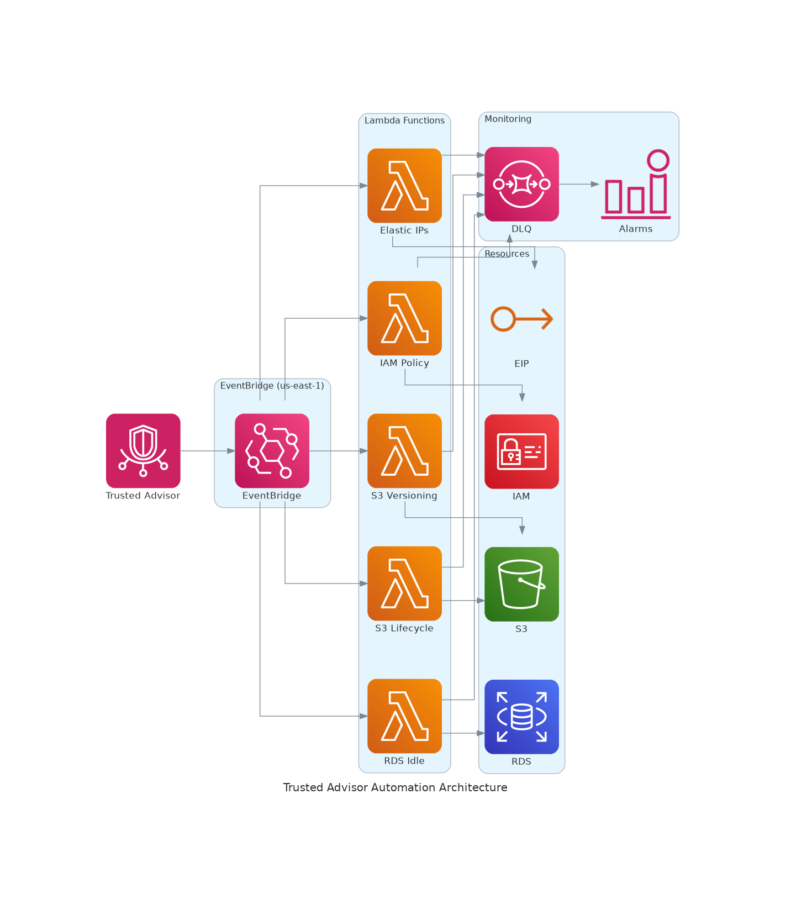

# AWS Trusted Advisor Automation Tools

[](https://aws.amazon.com/premiumsupport/trustedadvisor/)
[](https://www.python.org/)
[](LICENSE)
[](https://aws.amazon.com/serverless/sam/)

> **Automate AWS cost optimization, security, and performance improvements using Trusted Advisor recommendations with EventBridge and Lambda.**

## 🏗️ Architecture



## ✨ Features

- 🔒 **Security Automation** - Auto-remediate exposed IAM keys, enforce password policies
- 💰 **Cost Optimization** - Release unused Elastic IPs, stop idle RDS instances
- 🛡️ **Data Protection** - Enable S3 versioning, configure lifecycle policies
- 📊 **Observability** - CloudWatch Logs, Alarms, X-Ray tracing, Dead Letter Queues
- ⚡ **Serverless** - Python 3.12, ARM64 (Graviton2), pay-per-use

## 📋 Prerequisites

- AWS Account with **Business Support+**, **Enterprise Support**, or **Unified Operations** plan
- [AWS SAM CLI](https://docs.aws.amazon.com/serverless-application-model/latest/developerguide/install-sam-cli.html)
- Trusted Advisor events emit to EventBridge in **us-east-1 only**

## 🚀 Quick Start

```bash
# Clone repository
git clone https://github.com/vanhoangkha/trusted-advisor-tools.git
cd trusted-advisor-tools

# Deploy a solution (example: Unassociated Elastic IPs)
cd UnassociatedElasticIPs
sam build && sam deploy --guided --region us-east-1
```

## 📦 Available Solutions

| Solution | Description | Status |
|----------|-------------|--------|
| [UnassociatedElasticIPs](UnassociatedElasticIPs/) | Release unassociated Elastic IP addresses | ✅ Production |
| [S3BucketVersioning](S3BucketVersioning/) | Enable S3 bucket versioning | ✅ Production |
| [IAMPasswordPolicy](IAMPasswordPolicy/) | Enforce IAM password policy | ✅ Production |
| [AmazonRDSIdleDBInstances](AmazonRDSIdleDBInstances/) | Stop/delete idle RDS instances | ✅ Production |
| [S3IncompleteMPUAbort](S3IncompleteMPUAbort/) | Apply S3 lifecycle rules for incomplete uploads | ✅ Production |
| [ExposedAccessKeys](ExposedAccessKeys/) | Delete exposed IAM keys, notify security | 🔧 CloudFormation |
| [LowUtilizationEC2Instances](LowUtilizationEC2Instances/) | Stop low utilization EC2 instances | 🔧 CloudFormation |
| [HighUtilizationEC2Instances](HighUtilizationEC2Instances/) | Resize overutilized EC2 with approval | 🔧 CloudFormation |
| [TA-Responder](TA-Responder/) | Generic framework with Bedrock AI | 🔧 CloudFormation |

## 🛠️ AWS Best Practices Applied

### Lambda Functions
- ✅ SDK clients initialized outside handler
- ✅ Structured JSON logging
- ✅ Environment variables for configuration
- ✅ Input validation & error handling
- ✅ Idempotent design
- ✅ Least privilege IAM

### Infrastructure
- ✅ Python 3.12 + ARM64 (Graviton2)
- ✅ X-Ray distributed tracing
- ✅ Dead Letter Queues (DLQ)
- ✅ CloudWatch Alarms
- ✅ Log retention policies
- ✅ KMS encryption

## 🔧 EventBridge Pattern

```json
{
  "source": ["aws.trustedadvisor"],
  "detail-type": ["Trusted Advisor Check Item Refresh Notification"],
  "detail": {
    "status": ["WARN"],
    "check-name": ["<specific-check-name>"]
  }
}
```

## 🔐 Security

1. **DryRun mode** enabled by default - test before applying changes
2. **Tag-based exclusions** - protect critical resources
3. **Scoped IAM permissions** - least privilege access
4. **Encrypted queues** - KMS encryption for DLQs

## 📚 Documentation

- [Monitoring Trusted Advisor with EventBridge](https://docs.aws.amazon.com/awssupport/latest/user/cloudwatch-events-ta.html)
- [AWS Lambda Best Practices](https://docs.aws.amazon.com/lambda/latest/dg/best-practices.html)
- [IAM Security Best Practices](https://docs.aws.amazon.com/IAM/latest/UserGuide/best-practices.html)
- [Trusted Advisor Check Reference](https://docs.aws.amazon.com/awssupport/latest/user/trusted-advisor-check-reference.html)

## 🤝 Contributing

Contributions welcome! Please read [CONTRIBUTING.md](CONTRIBUTING.md) for guidelines.

## 📄 License

This project is licensed under the Apache 2.0 License - see [LICENSE](LICENSE) file.

---

**Keywords**: AWS Trusted Advisor, Lambda automation, EventBridge, cost optimization, security automation, serverless, SAM, CloudFormation, Python, DevOps, FinOps, cloud governance
